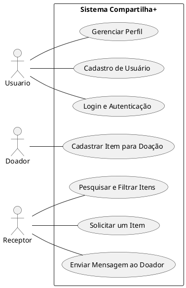

# Sistema Compartilha +

Compartilha+ é uma plataforma de doações que conecta doadores e receptores de itens.

## 1. Diagrama de casos de uso

**2. Descrições dos casos de uso**

**2.1. Cadastro de Usuário (CU001)**

**Resumo**: Permite que novos usuários se cadastrem na plataforma.
Ator Principal: Usuário
Pré-condições: Não estar cadastrado.
Pós-condições: Conta criada e confirmada por e-mail.

**Fluxo Principal**

Usuário acessa a página de cadastro.

Preenche nome, e-mail, senha e aceita os termos.

Sistema valida dados e envia confirmação por e-mail.

Usuário confirma e sistema redireciona à home.

**Fluxo Alternativo**

Cadastro via login social (Google/Facebook).

**2.2. Login e Autenticação (CU002)**

**Resumo**: Permite que usuários registrados façam login na plataforma.
Ator Principal: Usuário
Pré-condições: Conta cadastrada e confirmada.
Pós-condições: Usuário autenticado e redirecionado para a home.

**Fluxo Principal**

Acessar a página de login.

Inserir e-mail e senha.

Sistema valida credenciais e redireciona.

**Fluxo Alternativo**

Recuperar senha por e-mail.

**2.3. Cadastrar Item para Doação (CU003)**

**Resumo:** Permite que o doador cadastre itens para doação.
Ator Principal: Usuário Doador
Pré-condições: Estar autenticado.
Pós-condições: Item aparece na listagem de doação.

**Fluxo Principal**

Acessar opção “Doar um Item”.

Preencher detalhes do item.

Confirmar doação.

**Fluxo Alternativo**

Editar ou excluir posteriormente.

**2.4. Pesquisar e Filtrar Itens (CU004)**

**Resumo:** Permite que o receptor encontre itens para doação.
Ator Principal: Usuário Receptor
Pré-condições: Estar autenticado.
Pós-condições: Visualização de resultados relevantes.

**Fluxo Principal**

Acessar a página de itens.

Buscar por palavras-chave ou filtros.

Visualizar resultados e detalhes.

**Fluxo Alternativo**

Sistema sugere itens similares.

Usuário altera filtros ou salva a busca.

**2.5. Solicitar um Item (CU005)**

**Resumo:** Permite que um receptor solicite um item desejado.
Ator Principal: Usuário Receptor
Pré-condições: Estar autenticado.
Pós-condições: Doador recebe notificação e decide.

**Fluxo Principal**

Acessar a página do item.

Clicar em “Solicitar Doação”.

Sistema envia notificação ao doador.

**Fluxo Alternativo**

Receptor pode cancelar antes da resposta.

**2.6. Gerenciar Perfil (CU006)**

Resumo: Permite ao usuário gerenciar dados pessoais e atividades.
Ator Principal: Usuário
Pré-condições: Estar autenticado.
Pós-condições: Dados atualizados no sistema.

**Fluxo Principal**

Acessar perfil.

Visualizar e editar informações.

Salvar alterações.

**Fluxo Alternativo**

Confirmação de senha para editar.

E-mail duplicado gera alerta.

Falha na atualização mostra erro.

Pode excluir a conta.

**2.7. Enviar Mensagem ao Doador (CU007)**

**Resumo:** Permite que receptores tirem dúvidas sobre itens.
Ator Principal: Usuário Receptor
Pré-condições: Estar autenticado e visualizar item.
Pós-condições: Doador recebe mensagem.

**Fluxo Principal**

Acessar página do item.

Clicar em “Enviar Mensagem”.

Digitar e enviar mensagem.

**Fluxo Alternativo**

Doador pode desativar mensagens.
